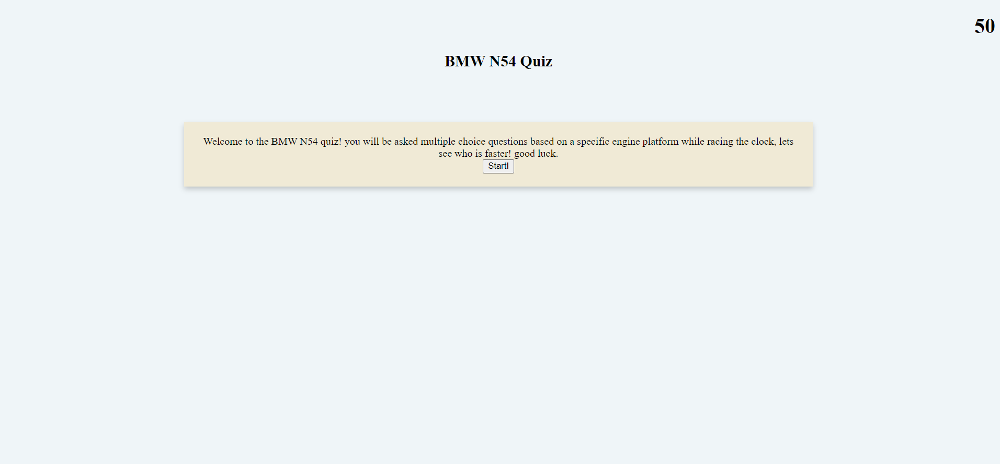

# bmw-n54-quiz

# <bmw-n54-quiz>

## Description

- Test general BMW knowledge using a creative quiz module.
- Race against the time by answering questions to become a BMW N54 expert
- Created as a quick reference point for N54 mechanics while also
making it fun for enthusiasts.

## Table of Contents

- [Installation](#installation)
- [Usage](#usage)
- [Credits](#credits)
- [License](#license)

## Installation

This tool is embedded in a URL. No installation required. 

## Usage

Once the website is launched, you will be brought to a main menu. Click start to begin the quiz. There are five questions and the user has fifty seconds to complete the quiz. Each incorrect answer deducts five seconds from the current time.

## Credits

Kyle Giuanta https://github.com/kgiunta

Isaak Morales https://github.com/CallMeIce

## License
Not Applicable

## Badges

